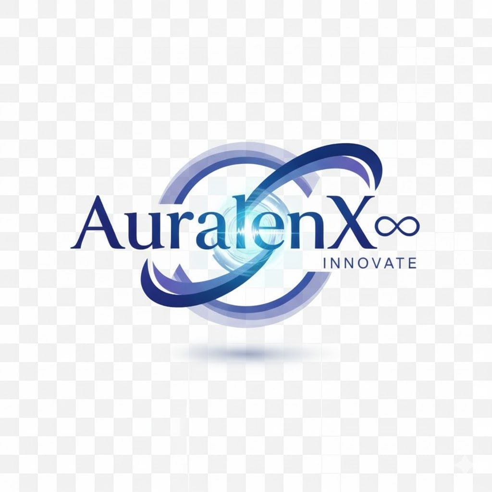

<!-- Banner / Logo -->

  

<!-- Typing SVG -->

  

---

# 🌐 **AuralenX∞**
### *Engineering the future through intelligent systems, automation and software innovation.*

AuralenX∞ is a modern engineering and technology brand dedicated to building  
powerful, scalable, and intelligent solutions across:

- IoT & Embedded Systems  
- Full-Stack Web Development  
- Mobile Application Development  
- Cloud & Automation Platforms  
- Smart Device Monitoring Systems  

We merge **hardware + software** into seamless real-world products.

---

## 🚀 **Quick Access**
- 🌍 **Website:** [auralenx.com](https://auralenx.com)  
- 📦 **GitHub Projects:** [GitHub](https://github.com/AuralenX?tab=repositories)  
- 📧 **Email:** [auralenx.team@gmail.com](mailto:auralenx.team@gmail.com)  
- 🔗 **LinkedIn:** [LinkedIn](https://www.linkedin.com/company/auralenx)  

---

## 🧭 **About AuralenX∞**
Founded by **Asiedu Kwaku Mintah**, an innovative engineer specializing in IoT, electronics, and software architecture.  

We design and develop solutions that connect:

- Intelligent sensors  
- Embedded microcontrollers  
- Secure cloud databases  
- Real-time dashboards  
- Mobile & web interfaces  

🌀 *“Precision, intelligence, and creativity — this is how we build the future.”*

---

## 🎯 **Mission**
To create world-class technology that blends electronics, automation, cloud systems,  
and intelligent design to improve businesses, communities, and daily life.

---

## ⚡ **What We Build**
### 🟦 **IoT & Embedded Systems**
- ESP32/Arduino solutions  
- Sensor networks  
- Smart automation  
- Real-time monitoring devices  

### 🟩 **Software Development**
- Full-stack applications  
- Scalable API architecture  
- Mobile apps (Android/iOS)  
- Cloud solutions (Firebase, Node.js)  

### 🟪 **Automation & Engineering**
- Smart control dashboards  
- Cloud integration  
- Security systems  
- Data visualization tools  

---

## 🛠️ **Tech Stack**

### 💻 **Languages**
`JavaScript` • `HTML` • `CSS` • `C++` • `SQL` • `Python`

### ⚙️ **Frameworks & Tools**
`Node.js` • `Express` • `Firebase` • `Arduino` • `ESP32` • `Git` • `React`

### 🌩️ **Domains**
- IoT Systems  
- Cloud Architecture  
- Embedded Engineering  
- Real-Time Data Sync  
- Security & Authentication  
- Automation & Control Systems  

---

## 🚀 **Flagship Projects**

### 📡 **Smart IoT Control Hub**
A cloud-connected system for real-time device monitoring and automation.  
Built with **ESP32 + Firebase + Node.js + Web Dashboard**.

**Core Features**
- 🔌 Real-time device sync  
- 🔒 Secure authentication  
- ☁️ Cloud storage  
- 📊 Dashboard UI  

---

### 🦯 **SmartStick 1.8 — Assistive Smart Stick**
A safety device for the visually impaired featuring:

- Ultrasonic obstacle detection  
- Depth measurement  
- GPS module (NEO-6M)  
- SIM800L Call and SMS alert system  
- Vibration + buzzer feedback  
- Emergency button with live location  

---

## 📊 **GitHub Analytics**

  
  

  

  

---

## 🌐 **Connect With Us**

---

## ✨ **AuralenX∞ Signature**
> “Technology is the bridge between imagination and reality.  
> At AuralenX∞, we build that bridge with intelligence.”
